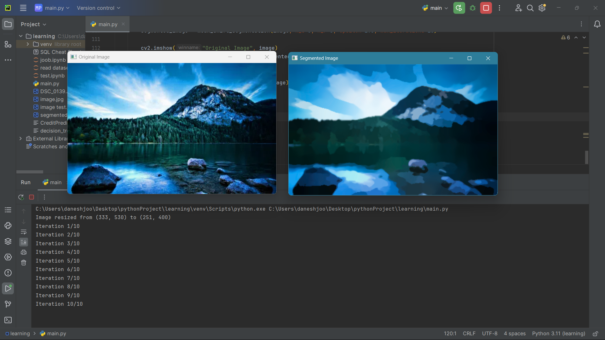
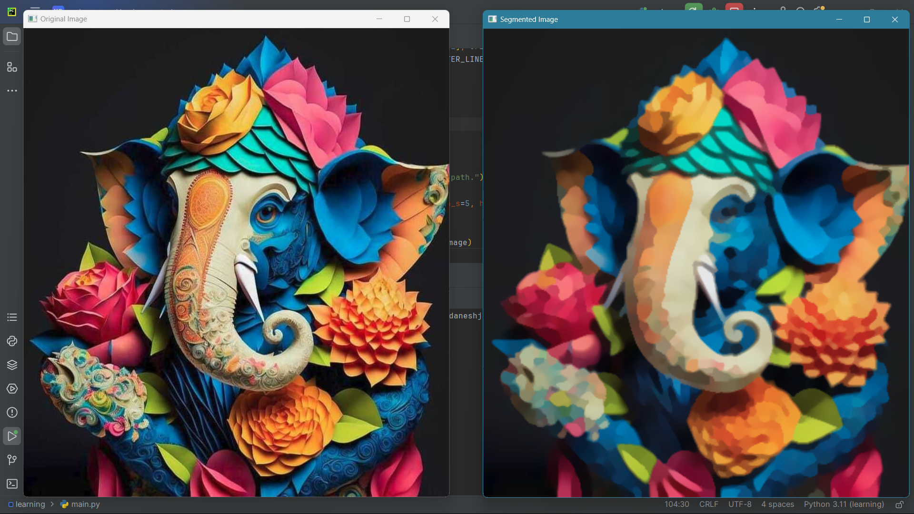

# 🖼️ Mean Shift Image Segmentation

This project implements **Mean Shift Segmentation** using **k-d trees** for efficient nearest neighbor search.  
The algorithm segments an image into regions based on both **spatial** and **color** features.

---

## 📌 Features
- Custom **Mean Shift** implementation (no dependency on OpenCV's `pyrMeanShiftFiltering`)
- Uses **cKDTree** for faster neighbor search
- Works in **LAB color space** for better perceptual segmentation
- Adjustable parameters for:
  - Spatial bandwidth (`h_s`)
  - Range (color) bandwidth (`h_r`)
  - Convergence threshold (`epsilon`)
  - Maximum iterations
- Resizes large images automatically for efficiency
- Saves and displays the segmented result

---

## 📂 Project Structure  
MeanShift_Segmentation/  
│  
├── image sample_1.png # Sample input and output image  
├── image sample_2.png # Sample input and output image  
├── main.py # Main project script  
└── README.md # Documentation  


---

## ⚙️ Requirements
Install the required dependencies:
```bash
pip install numpy opencv-python scipy
```

---

## 🚀 How to Run
1. Clone the repository

```
git clone https://github.com/username/MeanShift_Segmentation.git
cd MeanShift_Segmentation
```
2. Run the script

```
python main.py
```
3. View the result
The segmented image will be displayed in a window and saved as segmented_image.jpg.

---

## ⚙️ Parameters
You can tweak these parameters in the script for different results:

- h_s → Spatial bandwidth (default: 5)

- h_r → Range (color) bandwidth (default: 5)

- epsilon → Convergence threshold (default: 1.0)

- max_iterations → Maximum number of Mean Shift iterations (default: 10)

- max_size → Maximum allowed image size before resizing (default: 400px)

---

## 📸 Example Output

**Sample_1 Image:**


**Sample_2 Image:**



---
## 🧠 How It Works
1. Preprocessing

- Optionally resize large images

- Smooth image with a Gaussian blur to reduce noise

- Convert from BGR to LAB color space

2. Feature Construction

- Combine spatial coordinates (x, y) and LAB color values into feature vectors

- Normalize features by their respective bandwidths (h_s, h_r)

3. Mean Shift Iterations

- For each pixel, search for neighbors using cKDTree within a specified radius

- Calculate Epanechnikov kernel weights for spatial and color dimensions

- Move pixel feature vectors toward the mean of neighbors until convergence

3. Reconstruction

- Convert shifted LAB color values back to BGR

- Resize result back to original dimensions if needed

---
## 👨‍💻 Author
 Bardia Javadi   
  📧 bardia.javadi.2003@gmail.com    
  🌐 GitHub: [@bardiw](https://github.com/bardiw)   
  
